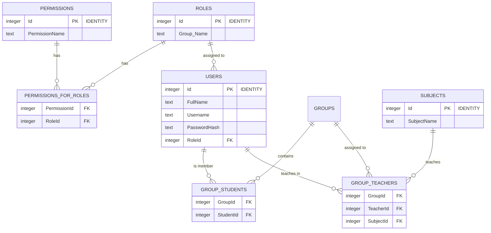
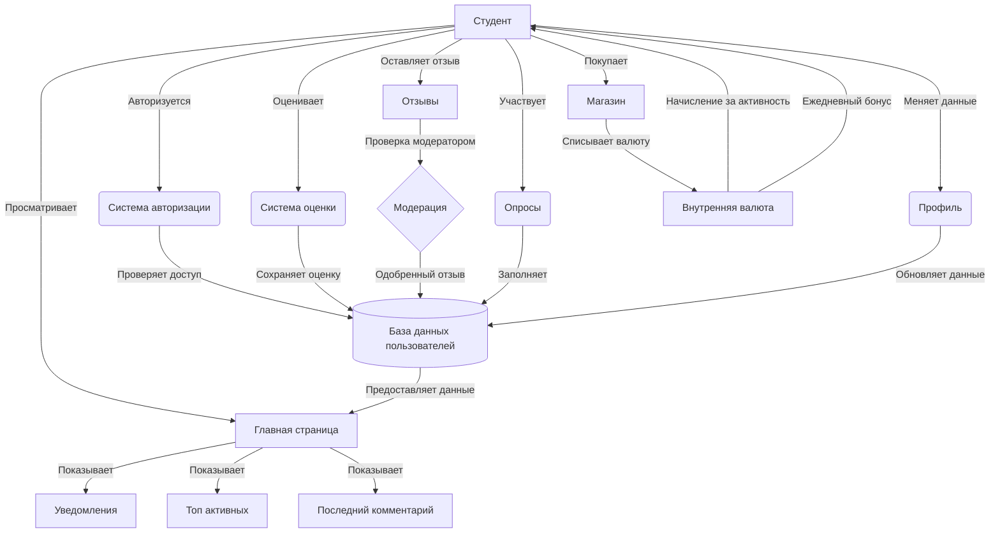

# Проект: KALM

## Команда
- Морякина В.А - Аналитик, дизайнер
- Курская А.С. - FrontEnd, дизайнер
- Каланчекаев Н.М. - Backend, тимлид

---

## Лабораторная работа 1. Web как источник данных
**Цель**: Овладение навыками работы с машиночитаемыми данными в Интернете.  
**Срок**: 6 неделя  

### Задачи
- [x] Определить целевые источники данных (API VK, парсинг веб-страниц).  
- [ ] Написать код для сбора данных (Python: `Requests`, `BS4`).  
- [x] Реализовать инициализацию БД (PostgresSQL, C#).  
- [x] Подготовить `README.md` с описанием проекта и алгоритмов.

**Доплнительно**:  
- Заполнить БД первичными данными 

---

## Лабораторная работа 2. Сбор данных и проектирование приложения
**Цель**: Навыки сбора данных и проектирования веб-приложений.  
**Срок**: 8 неделя 

### Задачи
- [ ] Формализовать сущности БД (ERD-диаграмма).  
- [x] Собрать данные через API (демонстрация работы).  
- [ ] Реализовать алгоритмы обработки данных (DFD, IDEF0).  
- [ ] Спроектировать API (OpenAPI-спецификация).  

## ERD

## DFD возможных действий студента

---

## Лабораторная работа 3. Прототип приложения
**Цель**: Прототипирование бэкенда и интерфейса.  
**Срок**: 12 неделя  
**Баллы**: 10 (в срок), 6 (с опозданием)  

### Задачи
- [ ] Реализовать API серверной части.  
- [ ] Создать макеты интерфейса в Figma.  
- [ ] Разработать прототип клиентской части (Proof of Work).  

---

## Лабораторная работа 4. Приложение
**Цель**: Завершение разработки приложения.  
**Срок**: 15 неделя

### Задачи
- [ ] Интегрировать серверную и клиентскую части.  
- [ ] Реализовать интерактивную визуализацию данных.  
- [ ] Настроить деплой (CI/CD, опционально).  

---

## Лабораторная работа 5. Публичная защита
**Цель**: Представление результатов.  
**Срок**: 17 неделя

### Задачи
- [ ] Подготовить презентацию.  
- [ ] Провести публичную защиту.  
- [ ] Опубликовать тезисы (опционально).  

**Критерии**:  
- Презентация с описанием проекта.  
- Успешная защита перед аудиторией.  

---

## Общий прогресс
| Этап            | Статус       |
|-----------------|-------------|
| ЛР1: Сбор данных | 🟡 В процессе |
| ЛР2: Проектирование | ⚪ Не начато |
| ЛР3: Прототип    | ⚪ Не начато |
| ЛР4: Приложение  | ⚪ Не начато |
| ЛР5: Защита      | ⚪ Не начато |

---

## Технологии
- **Backend**: Python (OpenAPI), C#  
- **Frontend**: HTML/CSS/JS, React  
- **База данных**: PostgresSQL 
- **Инструменты**: Figma, GitLab CI/CD, OpenAPI  

---

## Ссылки
- [Репозиторий проекта](https://git.iu7.bmstu.ru/ваш-проект)  
- Figma-макеты(Позже)  
- OpenAPI-документация(Позже)  
